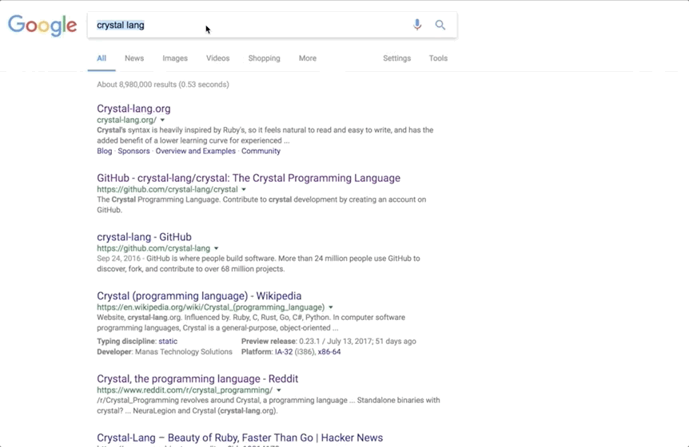

Google Tab Hotkey
================

I use Google search very heavily.
It would save a lot of time if I didnt have to grab the mouse to click the link I want.
The default TAB behavior gets you nowhere fast.
I'd rather scroll through each link by pressing TAB and shift+TAB.
This Chrome extension adds that functionality.

This isn't on the official Chrome Web Store yet, so you can clone the code and install it manually at chrome://extensions, assuming you have developer mode enabled.

